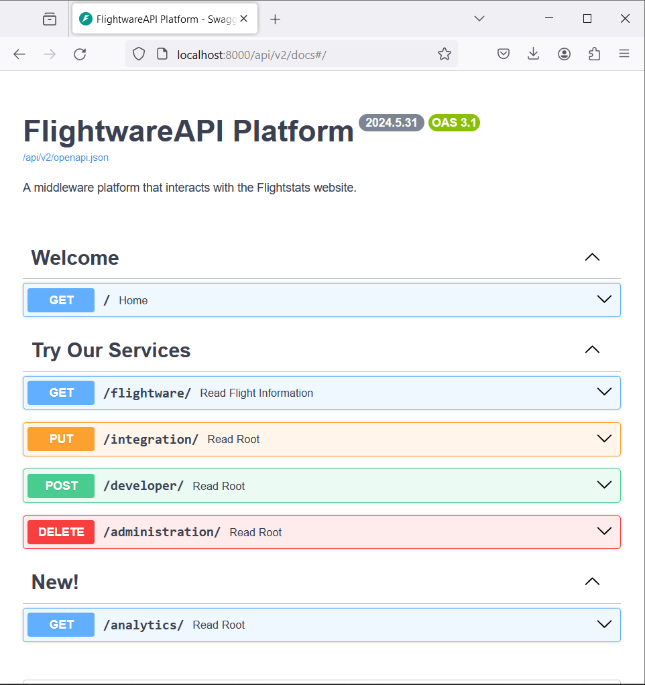
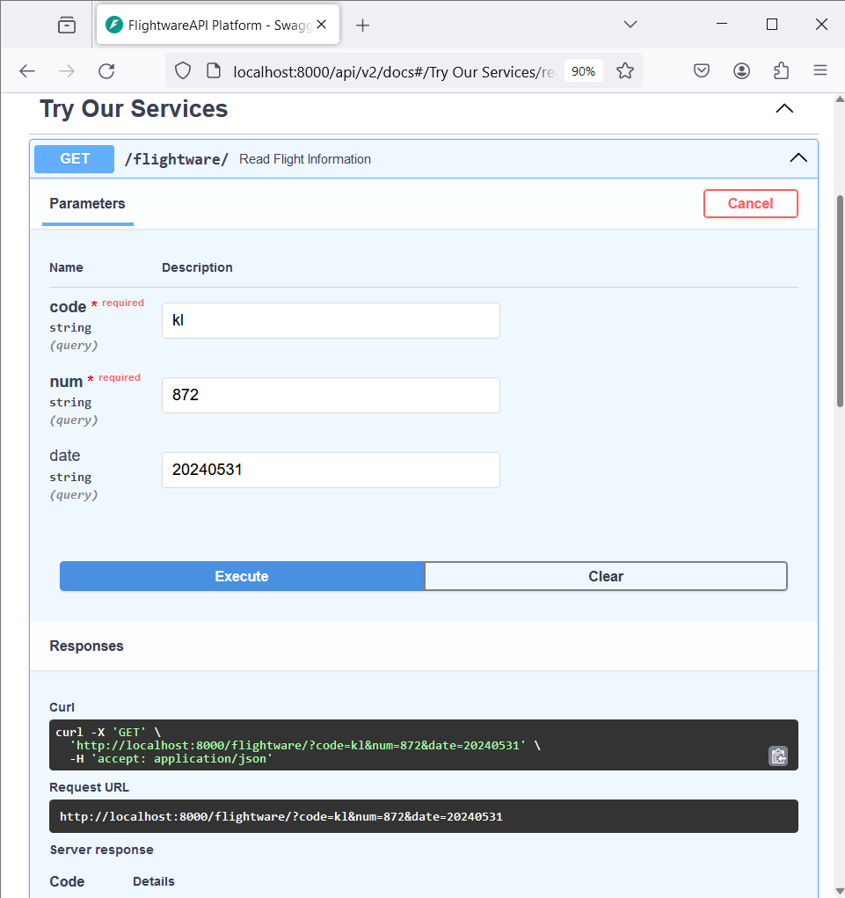
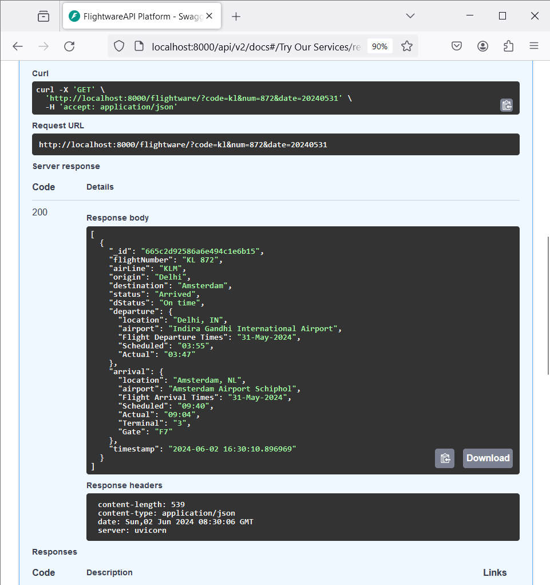

# FlightwareAPI

FlightwareAPI is a middleware platform designed to interact with the Flightstats website. It implements a Web Scraping mechanism to extract flight information.



## Objective

The primary objective of FlightwareAPI is to provide a convenient and reliable way to access flight information from Flightstats website programmatically. By utilizing web scraping techniques, FlightwareAPI retrieves data such as flight schedules, statuses, and other relevant details.

## Features

- **Flight Information Retrieval**: Extracts flight details including schedules, statuses, and more.
- **Flexible Integration**: Designed for easy integration into various applications and systems.
- **Customizable Queries**: Allows customization of queries to tailor the extracted data based on specific requirements.

## Getting Started

To get started with FlightwareAPI, follow these steps:

1. Clone the repository:
    ```bash
    git clone https://github.com/miozilla/flightware.git
    ```

2. Install the necessary dependencies:
    ```bash
    install python 3.8 or above
    #optional: pip3 install uvicorn scrapy fastapi pymongo
    pip install -r requirements.txt
    install/configure mongodb server               # mongodb://localhost:27017/
    ```

3. Run the middleware platform:
    ```powershell
    # tested on windows host
    ~> cd .\flightware\                            # project dir
    ~\flightware> .\venv\Scripts\Activate.ps1      # use venv for testing
    (venv) PS C:\test\20240529a\proj001a\flightware>
    # start API server
    uvicorn main:app --reload
    ```

4. Access flight information programmatically through the provided API endpoints.

## Usage

FlightwareAPI provides a simple API for accessing flight information. Here's a basic example of how to use it:

```html5 browser
http://localhost:8000/api/v2/docs#/

# Try Our Services
GET /flightware/ Read Flight Information

# Example: Retrieve flight schedule
code*: HA
num*: 60
date: 20240531

- Note*: Query process take approximately **10 seconds**...

```






## *Author*
Mior

